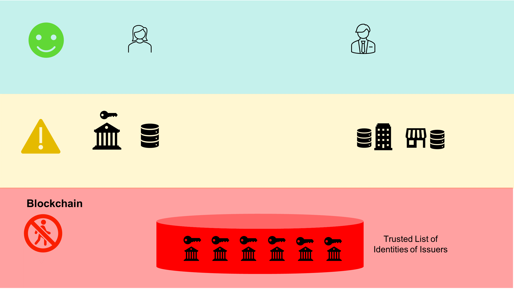
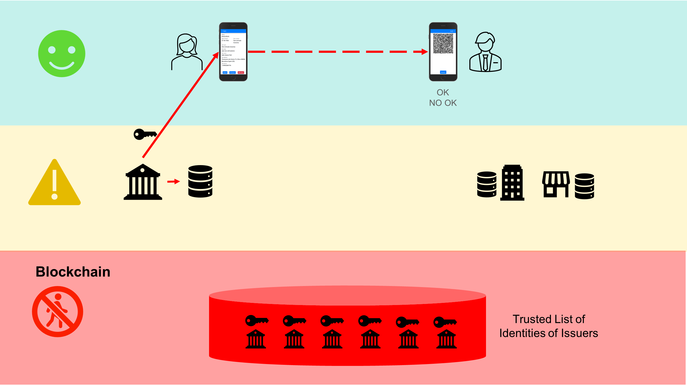
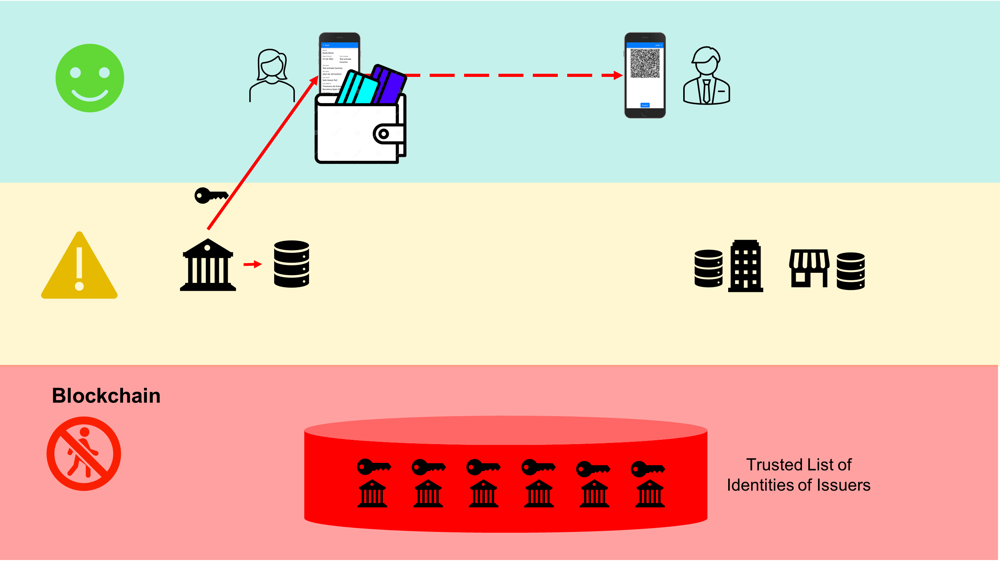
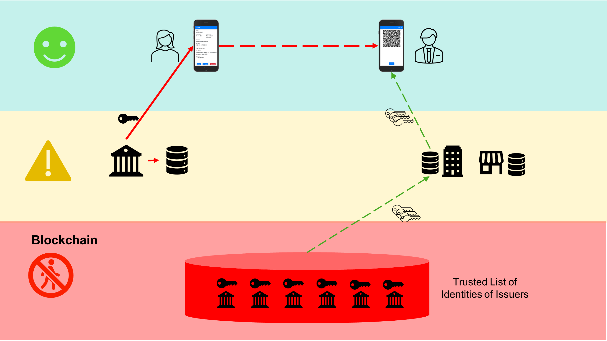
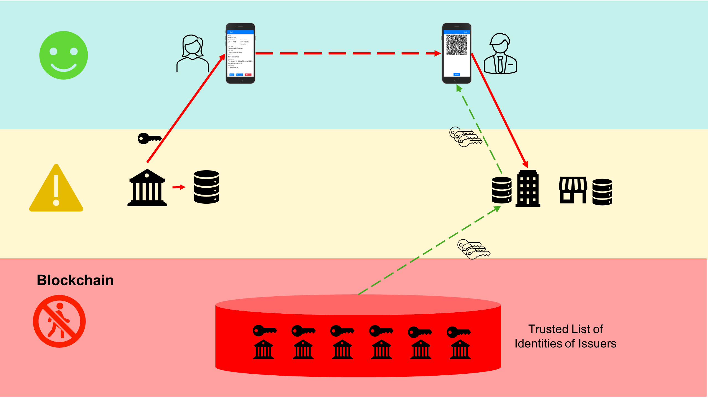

# Overview of the system

This section provides an overview of the system. The description is focused especially on the privacy characterictics of the system, given that it is the most important property. 

## The three zones for personal data

To facilitate reasoning about tecnology and personal data, the system can be divided into three relevant zones.

At the top we have the `citizen's zone`, represented in green.
In the intermediate level we have the `entities zone`, with the businesses and organistions that manage or process personal data from the citizens, and represented in yellow.
At the bottom we have the `blockchain zone`. It is red because the fundamental rule for any blockchain application is that personal data never has to be written to the blockchain, even if it is encrypted (encrypted personal data is considered personal data if it is exposed publicly for a sufficiently long period).

We could start discussing about what can be considered personal data, and if a hash of personal data is considered personal data or not. But this is irrelevant here because in this system no personal data is ever written to the blockchain, including any type of hash from personal data.

The information stored in the blockchain is the identities of the juridical persons involved, including the public key that will be used to verify the signatures from the entities issuing certificates.
The blockchain stores the Trusted List of en
that the entities issuing certificates 
Lo que se graba en el Blockchain (que en este caso es la Red T de los socios de Alastria), son las identidades de las personas jurídicas que intervienen, que incluye la clave pública que las entidades emisoras de certificados usarán para firmar digitalmente los certificados en formato Credencial Digital COVID EU. Porque el sistema utiliza el mismo formato de datos, pero lo mejora y simplifica gracias al uso de una red Blockchain.
Es decir, en el Blockchain se almacena y gestiona la Lista de Entidades Confiables que son las únicas autorizadas a emitir certificados.

## The flow of a certificate

The following figure describes the basic flow of a certificate:

The authorised issuer entity creates and digitally signs the certificate, and sends it to the citizen via several mechanisms. The personal data flows are marked in red.

The relationship between the citizen and the issuer entity is subject to current regulation (e.g., GDPR) and the existence of the blockchain does not change anything.
The diagram presents also the possibility that the entity stores some personal data in its own data base, always within the framework of the same personal data regulation.

The critical feature is that there is not any write operation to the blockchain during the issuance process.

The certificate is sent from the citizen to the verifier by means of a QR code which is implemented in such a way that there is no need for any intermediate server. Transmission is purely P2P in the safe `citizen's zone` without involvement of any entity, of course not even the issuer of the certificate.

## Replicating the privacy features of the physical world

The privacy features of the system can be better understood by making an analogy with the real world: The citizen is holding a wallet and a set of cards inside.

This is represented in the figure above and the following properties hold:

- The citizen can use whatever wallet she wishes, because the wallet follows a set of standards. In the physical world, all wallets are interchangeable as far as they can hold standard-size cards.

- The citizen can use more than one wallet, either in parallel or sequentially. In the physical world, she can easily move the cards from one wallet to another, depending on the situation (e.g., she goes to the beach and moves a subset of the cards to a special wallet for a specific period of time).

- In order to obtain a wallet, the citizen does not need to register in any system or provide any personal data to any entity. In the analogy with the physical world, the citizen can go to a shop and pay for a wallet she likes in complete anonymity with respect to the wallet seller. There may be wallets for free (e.g., as gifts from entities), or if the customer so wishes, `fancy` wallets that the citizen has to pay.

- The above does not preclude the existence of wallets that require registration from citizens (and so requiring personal data). In the physical world, this may be analogous to obtaining a wallet because the citizen belongs to a club or is employed in a company, or as a gift because the citizen is the customer of a company.

- Once the citizen uses the wallet, the wallet does not send any personal information to the provider of the wallet. In the physical world, once the citizen has received the wallet, the seller of the wallet has no idea of what is the actual usage of the wallet by the citizen.

- However the digital wallet may communicate with the wallet provider to obtain patches or upgrades, especially security fixes. In the physical world this would be analogous to the citizen going to the shop for some repairs on her wallet.

## Obtaining the public keys for local verification in the mobile

We now complete the flow of information in the system for the basic credential issuance and verification process.

In order to be able to perform local verification of credentials in the mobile, we need the public keys of issuers. This is represented in the following figure, where the arrows are green because the information is public and in addition they are queries, never writes.

There may be two main scenarios: one where the verifier is an individual citizen and the second when the verifier is an employee acting on behalf of a company that wants to verify certificates as part of its business process (e.g., a hotel on check-in of guests). We discuss here the first scenario, and the second will be discussed in the next section.

In this scenario there are two citizens involved: the one holding the credential and the one acting as verifier.

The mobile of the citizen acting as verifier can not access directly the blockchain and requires an intermediate server, operated by some entity. Typically, that entity operates both a "traditional" server and a blockchain node that it can access without restriction.

From the point of view of data privacy, the intermediate server can never have access to the personal data of the citizen presenting the credential to the verifier.

For the verifier, the amount of harm that an untrusted entity can make is very low, but in any case it is important that verifiers use a trusted server or even better a pool of trusted servers.

The server receives HTTP GET requests from the verifier mobile for retrieving the public keys. Even though this is not done on each verification (the verifier mobile has a cache which is updated periodically), those requests could be used to try to track the citizen acting as verifier, using techniques like for example [device fingerprinting](https://en.wikipedia.org/wiki/Device_fingerprint).

It is expected that several trusted entities like public administrations, civil organisations or highly-regulated businesses operate intermediate servers that offer publicly the single API which is required for trusted verification by citizens. The service is just a query, very simple and can use aggressive caching techniques so it can scale massively.

Having a pool of public trusted operators of this service improves the resiliency of the verifier against malicious attacks. The citizen acting as verifier can configure the application to build the cache of public keys from queries to several servers, detecting wrong keys and avoiding censorship of some keys or just availability problems in the servers.

## Optional: verification in a server

In the case when the verifier is an employee acting on behalf of an entity and especially for very small businessess, the scheme described above can also be used. It may also be possible that an industry association provides one or more servers providing the service to its member entities, probably together with the "traditional" services that they may already be receiving from the industry association.

The system also supports making the verification in a given server. This feature may be useful for bigger entities and in some scenarios where they want to apply sophisticated business rules to the verification process, or when they require the storage in their databases of the credential data.

This is represented in the following diagram.

When making the validation in the server the verifier mobile has to send the certificate to the server, and this is represented by the new arrow in the diagram. The arrow is red because there is personal data involved. The entity receiving the personal data should comply with all applicable regulations.

From the diagram it is easy to see that the existence of a blockchain network does not have any influence in how personal data should be handled by all actors involved.