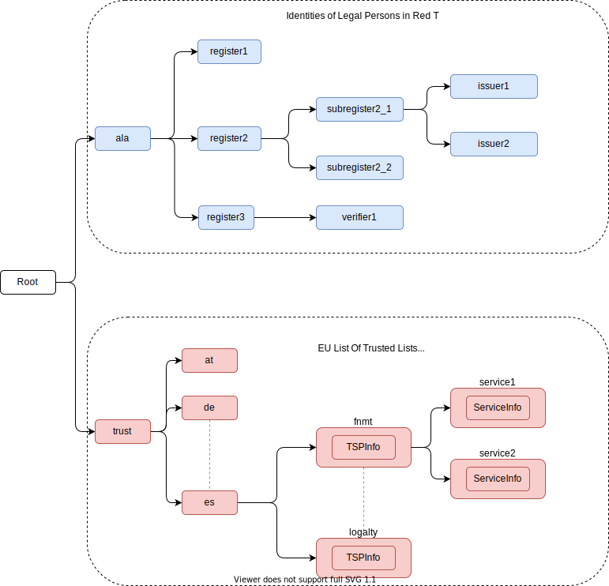

# Trust Framework

## Introduction

The trust framework is basically composed of two things:

1. A list of the identities of trusted organisations stored in the blockchain, together with associated information for each entity.
2. A process to add, modify and delete the trusted entities.

The trust framework is designed to be largely decentralised and represents the trust relationships in the real world.

The identities of the juridical persons involved in the ecosystem are registered in a common directory implemented in the blockchain following a hierarchical scheme very similar to the DNS (Domain Name Service) schema in the Internet. Once an entity is registered in the system, it is completely autonomous for adding other entities that are managed as child entities.

However, there is one centralised element: the root of trust at the top of the hierarchy should be a trusted entity in the ecosystem that is the one bootstraping the system. Typically it should be a regulatory body or a public administration.

The approach for a single blockchain network is described in the following figure.



The Trust Framework in a given blockchain is not really a flat list, but a hierarchical structure, implemented as a Smart Contract:

* There is a special organisation which is at the root of the hierarchy. Ideally, this is a regulator, like the Central Bank of the country to manage banks, or the Ministry of Education to manage universities.
* This root entity is responsible for registering the identities of some trusted entities. For example, in a country with several regions with autonomous competencies to manage universities, the Ministry of Education could register in the blockchain the identities of the regional institutions which are responsible for managing the universities in each of their regions.
* Once this is done, each of the regional institutions can register the identities of dependent entities, like universities.
* The hierarchy can have several levels. For example, a university can be big and have several organisational units with some autonomy, maybe distributed geographically. It can create sub-identities and register them as child nodes in the blockchain.

Some observations about this structure:

* An organisation can be registered in the blockchain only because its parent entity has registered it. No other entity in the Trust Framework can have performed the registration, not even the parent of the parent entity.
* An organisation is responsible for all its child entities, represented as child nodes in the blockchain.
* A third party external to the framework 


## Creating identities

A new identity can only be registered as a sub-node by an existing entity already registered in the system. The API used is **/api/did/v1/identifiers** and its definition is the following:

<div class="apidoc-postbox">
    <span class="apidoc-post">GET</span>
    <span class="apidoc-url">/api/did/v1/identifiers</span>
</div>

Create an Identity anchored in the blockchain.

**Request parameters**

The body of the request is a JSON object with the following fields

| Name | Type | Description | Example |
|------|------|-------------|---------|
| **DID** | string | The DID to resolve into a DID Document | "did:elsi:VATES-B60645900" |
| domain_name | string | Domain name to assign in the hierarchy | "in2.ala" |
| website | string | Website of the entity | "www.in2.es" |
| commercial_name | string | Commercial name | "IN2 Innovating 2gether" |
| new_privatekey | PrivatekeyJWK | The private key of the new entity | |
| parent_privatekey | PrivatekeyJWK | The private key of caller (in this case the owner of "ala") | |


**Example request**:

```json
{
    "DID": "did:elsi:VATES-B60645900",
    "domain_name": "in2.ala",
    "website": "www.in2.es",
    "commercial_name": "IN2 Innovating 2gether",
    "new_privatekey": {
        "kty": "EC",
        "crv": "secp256k1",
        "d": "Dqv3jmu8VNMKXWrHkppr5473sLMzWBczRhzdSdpxDfI",
        "x": "FTiW0a4r7S2SwjL7AlFlN1yJNWF--4_x3XTTxkFbJ9o",
        "y": "MmpxbQCOZ0L9U6rLLkD_U8LRGwYEHcoN-DPnEdlpt6A"
    },
    "parent_privatekey": {
        "kty": "EC",
        "crv": "secp256k1",
        "d": "Dqv3jmu8VNMKXWrHkppr5473sLMzWBczRhzdSdpxDfI",
        "x": "NKW_0Fs4iumEegzKoOH0Trwtje1sXsG9Z1949sA8Omo",
        "y": "g4B3EI0qIdlcXTn-2RpUxgVX-sxNFdqCQDD0aHztVkk"
    }
}
```

**Reply**

| Name | Type | Description |
|------|------|-------------|
| **payload** | json | The DID document associated to the input DID |


A more detailed explanation of each field in the request follows:

**DID**
:   is the DID of the new entity. We support ELSI DID method (ELSI_DID_Method) and AlastriaID. The DID has to be created before the call to the API with the appropriate method for the DID. In the case of ELSI this is trivial and described in the section mentioned above.

**domain_name**
:   the domain name for the new entity in the Trust Framework. In the example it is `in2.ala` because it will be a sub-node of the Alastria one. The new identity will be created as a child node of the existing node owned by the entity controlling the **parent_privatekey**. If the parent domain name specified here is not owned by the entity controlling the **parent_privatekey**, an error is returned and no action is taken.

**website**
:   the website address in the off-chain world, so other participants can look more information about the entity. This field is informational only. However, it can be used by external appications to check that the entity in th ereal world corresponds to the one registered in th eblockchain.

**commercial_name**
:   the name of the company as it appears in the official register of the country/region. For example, in the case of IN2 (a Spanish business), the name should be the one registered in the [Business Registry of Spain](http://www.rmc.es/Home.aspx?lang=en).

**new_privatekey**
:   is the Private Key of the new entity, in JWK format. In this case the new entity is IN2. Please make sure the server being called is highly trusted.

**parent_privatekey**
:   is the Private Key of the entity owning/controlling the parent node in the domain name, in JWK format. In this case the parent node is `ala`, corresponding to Alastria. Please make sure the server being called is highly trusted. Ideally, the server has to be operated by the same entity calling the API.
